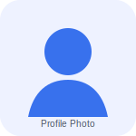

  <header class="cv-header">
    
    

      <h1>Ahmed Ali Hakim Abdulgawad</h1>
      
Medical Student | Aspiring Healthcare & Learning Technology Contributor

      

        <strong>Email:</strong> <a href="mailto:ahmedali17v@gmail.com">ahmedali17v@gmail.com</a> |
        <strong>Phone:</strong> <a href="tel:+201008988182">+20 100 898 8182</a> |
        <strong>WhatsApp:</strong> <a href="https://wa.me/201101452846">+20 110 145 2846</a>
      

    

  </header>

  <section class="cv-section">
    <h2>Profile</h2>
    

      Motivated medical student with strong curiosity, a commitment to continuous learning, and an interest in combining healthcare, education, and technology. I am proactive, adaptable, and determined to create opportunities for growth rather than waiting for them.
    

  </section>

  <section class="cv-section">
    <h2>Education</h2>
    <ul>
      <li>
        Medical Student — Faculty of Medicine, Minia University
      </li>
    </ul>
  </section>

  <section class="cv-section">
    <h2>Experience</h2>
    

      Although I am still at the beginning of my professional journey, I am actively developing my skills through learning, self-improvement, and personal projects. I aim to gain meaningful experience in medical education, healthcare innovation, and technology-supported learning.
    

  </section>

  <section class="cv-section">
    <h2>Skills</h2>
    <ul>
      <li><strong>Languages:</strong> English — B2; French — A2.</li>
      <li><strong>Digital skills:</strong> Microsoft Word, Microsoft PowerPoint, presentation preparation, and basic programming knowledge.</li>
      <li><strong>Professional strengths:</strong> Curiosity, self-learning, analytical thinking, communication, and presentation skills.</li>
    </ul>
  </section>

  <section class="cv-section">
    <h2>Projects</h2>
    <ul>
      <li>
        RafeeQ — A learning platform designed to support medical students with accessible educational resources and a structured study experience.
      </li>
    </ul>
  </section>

  <section class="cv-section">
    <h2>Interests</h2>
    

      My interests reflect a balance between strategic thinking, scientific curiosity, physical activity, and global awareness.
    

    <ul class="tag-list">
      <li>Chess</li>
      <li>Swimming</li>
      <li>Video Games</li>
      <li>Politics</li>
      <li>Historical Studies</li>
      <li>Historical Geography</li>
      <li>Political Geography</li>
      <li>Data Analysis</li>
      <li>Statistics &amp; Probability</li>
      <li>Electromagnetism</li>
      <li>Modern Physics</li>
    </ul>
  </section>

  <section class="cv-section">
    <h2>Contact</h2>
    <ul>
      <li><strong>Email:</strong> <a href="mailto:ahmedali17v@gmail.com">ahmedali17v@gmail.com</a></li>
      <li><strong>WhatsApp:</strong> <a href="https://wa.me/201101452846">+20 110 145 2846</a></li>
      <li><strong>Phone:</strong> <a href="tel:+201008988182">+20 100 898 8182</a></li>
    </ul>
  </section>

> To use your real profile picture, upload it to `assets/profile.jpg` and replace `assets/profile-placeholder.svg` in the image source above with `assets/profile.jpg`.
